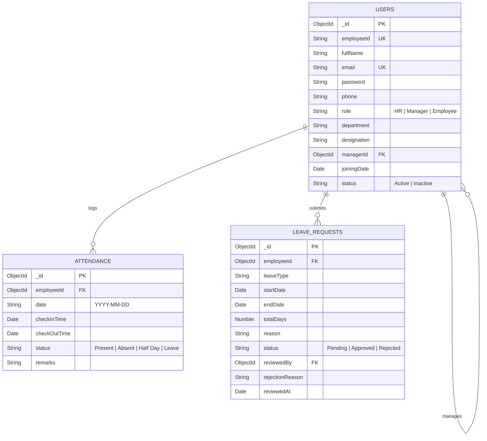

# 🏢 Mini HRMS - Human Resource Management System

A full-stack Role-Based HRMS built for SaaS companies to streamline employee directory management, daily attendance tracking, leave request workflows, and dynamic dashboards.

> **Assessment Submission**: AppTrait Solutions - Vibe Coder Practical Assessment  
> **Repository**: [Krishp2007/HRMS](https://github.com/Krishp2007/HRMS)  
> **Tech Stack**: MERN (MongoDB, Express.js, React.js, Node.js) + Tailwind CSS + JWT Authentication

---

## 🔑 Demo Credentials

| Role | Email | Password | Permissions Summary |
| :--- | :--- | :--- | :--- |
| **HR / Admin** | `hr@apptrait.com` | `password123` | Full system access: Add/Edit employees, activate/deactivate, company-wide attendance & leave approvals |
| **Manager** | `manager@apptrait.com` | `password123` | Team management: View assigned team, team attendance, approve/reject team leave requests |
| **Employee** | `employee@apptrait.com` | `password123` | Personal workspace: Mark daily attendance (check-in/out), apply for leave, view personal history |

---

## 🚀 Key Features & Business Rules

1. **Role-Based Access Control (RBAC)**:
   - Enforced on both Frontend UI (navigation guards) and Backend Controller/Middleware level.
   - Prevents unauthorized endpoint access, cross-team data access, and self-approval of leave requests.

2. **Employee Management**:
   - HR can create, update, activate/deactivate employee profiles and assign designated managers.
   - Live search by name/email/ID and filtering by department or status.

3. **Attendance Management**:
   - Single check-in per employee per day with real-time timestamp logging.
   - Check-out requirement validation (cannot check out without prior check-in).
   - Blocks check-in if the employee is on an approved leave on that date.

4. **Leave Management Workflow**:
   - Application with leave type, date range picker, automatic total days calculation, and reason.
   - Overlapping leave detection and prevention.
   - Approvals and rejections with mandatory rejection explanation text.

5. **Dynamic Dashboards**:
   - Real-time statistics calculated from MongoDB collections (no hardcoded metrics).

---

## 🛠️ Tech Stack & Architecture

- **Frontend**: React.js (Vite), Tailwind CSS, Lucide Icons, Axios, React Router v6
- **Backend**: Node.js, Express.js REST API
- **Database**: MongoDB & Mongoose ODM
- **Authentication**: JSON Web Tokens (JWT), Bcrypt password hashing
- **Security**: CORS, Input validation, RBAC Authorization Middleware

---

## 📊 Database Collections Schema



---

## 🔌 API Endpoints Summary (22 APIs)

| Module | Method | Endpoint | Allowed Roles | Description |
| :--- | :--- | :--- | :--- | :--- |
| **Auth** | `POST` | `/api/auth/login` | Public | Authenticate & issue JWT token |
| **Auth** | `GET` | `/api/auth/me` | All Roles | Fetch current logged-in profile |
| **Auth** | `POST` | `/api/auth/logout` | All Roles | Client session clear |
| **Employee** | `POST` | `/api/employees` | HR | Add new employee/manager |
| **Employee** | `GET` | `/api/employees` | HR, Manager | List employees (HR=All, Mgr=Team) |
| **Employee** | `GET` | `/api/employees/managers/list` | HR | Get list of managers for dropdowns |
| **Employee** | `GET` | `/api/employees/:id` | HR, Manager, Employee | Get employee profile (RBAC guarded) |
| **Employee** | `PUT` | `/api/employees/:id` | HR, Employee (self) | Update employee profile |
| **Employee** | `PATCH` | `/api/employees/:id/status` | HR | Activate / Deactivate employee |
| **Attendance** | `POST` | `/api/attendance/check-in` | All Roles | Record daily check-in timestamp |
| **Attendance** | `POST` | `/api/attendance/check-out` | All Roles | Record daily check-out timestamp |
| **Attendance** | `GET` | `/api/attendance/today-status` | All Roles | Get today's check-in/out status |
| **Attendance** | `GET` | `/api/attendance/my-history` | All Roles | Get personal attendance log |
| **Attendance** | `GET` | `/api/attendance/team` | Manager, HR | Get team attendance history |
| **Attendance** | `GET` | `/api/attendance/all` | HR | Get company-wide attendance log |
| **Leave** | `POST` | `/api/leaves` | All Roles | Submit leave application |
| **Leave** | `GET` | `/api/leaves/my-requests` | All Roles | View personal leave history |
| **Leave** | `GET` | `/api/leaves/team-requests` | Manager, HR | View team leave requests |
| **Leave** | `GET` | `/api/leaves/all-requests` | HR | View all company leave requests |
| **Leave** | `PATCH` | `/api/leaves/:id/approve` | Manager, HR | Approve leave (No self-approval) |
| **Leave** | `PATCH` | `/api/leaves/:id/reject` | Manager, HR | Reject leave with mandatory reason |
| **Dashboard** | `GET` | `/api/dashboard/stats` | All Roles | Get real-time dynamic stats cards |

---

## 🤖 AI Development Process (Section 8 Requirement)

During the development of this HRMS, AI tools (Antigravity & Gemini) were leveraged strategically to accelerate architectural design, schema modeling, edge case identification, and boilerplate generation. Below are 5 documented key prompts used:

### Prompt 1: Requirements Analysis & Complete System Planning
- **Prompt**: *"Analyze the AppTrait HRMS Assessment PDF and generate a detailed architecture plan covering requirement breakdown, database design, 22 REST APIs, and edge case handling rules."*
- **Why Used**: To rapidly map user stories into structured Mongoose schema attributes and API endpoint contracts.
- **AI Output**: A raw text summary listing basic endpoints and minimal field attributes.
- **What Accepted**: The multi-tiered module division (Auth, Employee, Attendance, Leave, Dashboard) and edge case definitions.
- **What Changed/Rejected**: Expanded the database schema to include explicit data types, default values, compound unique indexes (`{ employeeId: 1, date: 1 }`), and added mandatory rejection reasons to the leave schema.

### Prompt 2: Express Role-Based Access Control (RBAC) Middleware
- **Prompt**: *"Write a reusable Express middleware function `authorize(...roles)` that checks `req.user.role` against allowed roles and returns a 403 Forbidden error if unauthorized."*
- **Why Used**: To enforce security at the controller layer rather than relying solely on UI button hiding.
- **AI Output**: A basic middleware closure checking `roles.includes(req.user.role)`.
- **What Accepted**: The higher-order closure function pattern `(...roles) => (req, res, next) => { ... }`.
- **What Changed/Rejected**: Added a check for unauthenticated guest requests (`!req.user`) and ensured inactive user accounts (`status: 'Inactive'`) are automatically blocked in `authMiddleware.js`.

### Prompt 3: Attendance Check-in & Check-out Edge Cases
- **Prompt**: *"Create Express controller handlers for checkIn and checkOut that handle duplicate check-ins, check-out without check-in, and checking in while on approved leave."*
- **Why Used**: Attendance logic frequently has business edge cases that simple CRUD generators omit.
- **AI Output**: Basic `Attendance.create()` and `Attendance.findOneAndUpdate()` handlers without checking leave status.
- **What Accepted**: The check-in and check-out timestamp structure and `date` format string (`YYYY-MM-DD`).
- **What Changed/Rejected**: Rejected the direct update AI code. Added explicit pre-checks for existing check-in today, existing check-out today, and queried `LeaveRequest` collection to verify the employee isn't on approved leave today.

### Prompt 4: Overlapping Leave Requests Validation
- **Prompt**: *"Write a MongoDB query for leave request submission that checks if the applicant already has an approved or pending leave overlapping with the requested startDate and endDate."*
- **Why Used**: Overlapping leave requests create scheduling conflicts and duplicate time-off records.
- **AI Output**: Query checking `startDate === req.body.startDate`.
- **What Accepted**: The concept of checking `['Pending', 'Approved']` statuses.
- **What Changed/Rejected**: Rejected exact date equality match as it fails for multi-day range overlaps. Replaced it with the correct range overlap logic: `startDate: { $lte: newEndDate }` AND `endDate: { $gte: newStartDate }`.

### Prompt 5: Role-Aware Dynamic Dashboard Metrics Controller
- **Prompt**: *"Create a single `/api/dashboard/stats` controller that returns real-time metrics dynamically based on whether the logged-in user is HR, Manager, or Employee."*
- **Why Used**: To avoid hardcoding statistics cards and ensure dashboard data is computed from MongoDB collections.
- **AI Output**: Separate mock objects returned for each role.
- **What Accepted**: Returning role-specific JSON payloads.
- **What Changed/Rejected**: Rejected static mock data. Replaced with live `countDocuments()` queries filtering by `date`, `managerId`, and `status`.

---

## 🔍 AI Code Review Challenge (Section 9 Requirement)

Below are 2 critical cases where AI-generated backend code contained security vulnerabilities or logic flaws and required manual code review and remediation:

### Case 1: Unsafe Self-Approval & Cross-Team Manager Access in Leave Approval
- **What AI Generated**:
  ```javascript
  const approveLeave = async (req, res) => {
    const leave = await LeaveRequest.findById(req.params.id);
    leave.status = 'Approved';
    await leave.save();
    res.json(leave);
  };
  ```
- **What Was Wrong**: 
  1. A Manager could approve their own leave request (`req.user._id === leave.employeeId`).
  2. A Manager assigned to Team A could approve leave requests belonging to employees in Team B by passing their `leaveId` in the request parameter.
- **How Identified**: By auditing security requirements in Section 14 of the specification ("An employee must not be able to approve their own leave request", "Manager A must not be able to approve leave for another manager's team").
- **How Fixed**:
  - Added self-approval check: `if (leave.employeeId._id.toString() === req.user._id.toString()) return res.status(403).json(...)`.
  - Added cross-team check for managers: `if (req.user.role === 'Manager' && leave.employeeId.managerId.toString() !== req.user._id.toString()) return res.status(403).json(...)`.

### Case 2: Unchecked Duplicate Check-In Race Condition
- **What AI Generated**:
  ```javascript
  const checkIn = async (req, res) => {
    const attendance = await Attendance.create({
      employeeId: req.user._id,
      checkInTime: new Date()
    });
    res.json(attendance);
  };
  ```
- **What Was Wrong**:
  1. Clicking "Check-In" multiple times created duplicate records for the same date.
  2. The schema lacked a unique constraint, allowing multiple active attendance records per user on a single day.
- **How Identified**: Manual testing of Edge Case 6 & 7 in section 7 ("What happens if an employee clicks Check-in twice?").
- **How Fixed**:
  - Added a compound unique index in `Attendance.js`: `attendanceSchema.index({ employeeId: 1, date: 1 }, { unique: true })`.
  - Added a pre-query in `checkIn` controller checking `Attendance.findOne({ employeeId, date: todayStr })` before executing creation.

---

## 💻 Local Setup & Execution Guide

### Prerequisites
- Node.js (v18+)
- MongoDB running locally on port `27017` or a MongoDB Atlas URI

### 1. Clone Repository
```bash
git clone https.github.com/Krishp2007/HRMS.git
cd HRMS
```

### 2. Backend Setup (`/server`)
```bash
cd server
npm install
npm run seed     # Seeds demo HR, Manager & Employee accounts
npm run dev      # Starts API server on http://localhost:5000
```

### 3. Frontend Setup (`/client`)
```bash
cd ../client
npm install
npm run dev      # Starts React Vite dev server on http://localhost:5173
```

---

## 📝 License & Assessment Attribution
Built for the **AppTrait Solutions Vibe Coder Practical Assessment**.  
Author: **Krish Patel**
