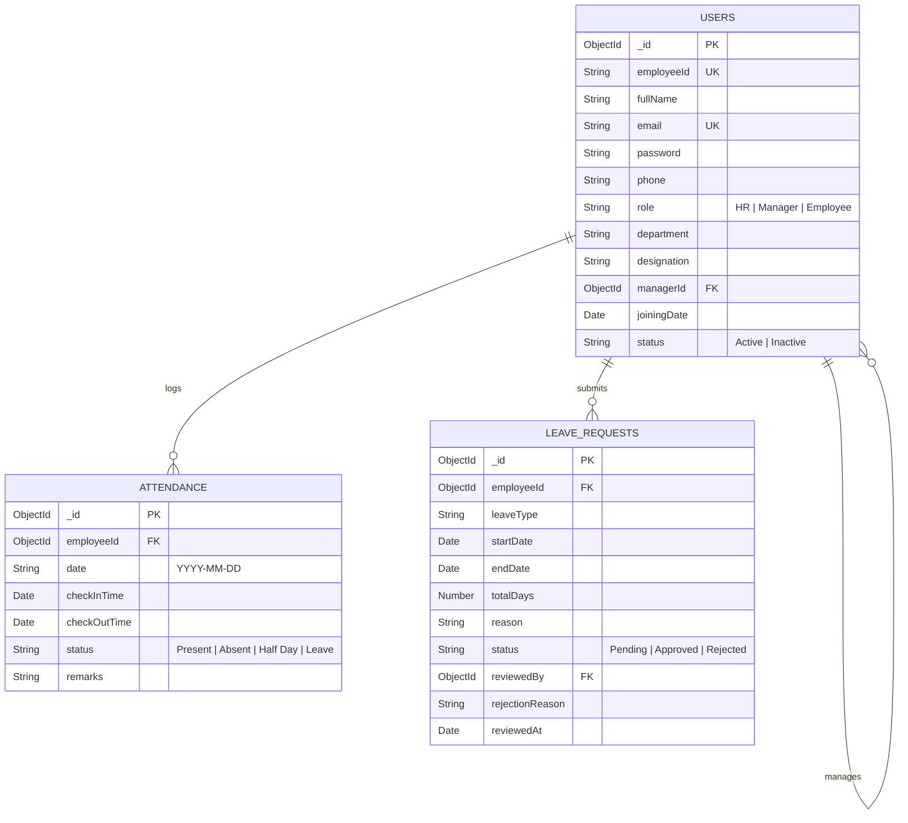

# 🏢 Mini HRMS - Human Resource Management System

A full-stack Role-Based HRMS built for SaaS companies to streamline employee directory management, daily attendance tracking, leave request workflows, and dynamic dashboards.

> **Assessment Submission**: AppTrait Solutions - Vibe Coder Practical Assessment  
> **Live Frontend**: [https://hrms-apptrait.vercel.app](https://hrms-apptrait.vercel.app)  
> **Live Backend API**: [https://hrms-zefl.onrender.com/api/health](https://hrms-zefl.onrender.com/api/health)  
> **Repository**: [Krishp2007/HRMS](https://github.com/Krishp2007/HRMS)  
> **Tech Stack**: MERN (MongoDB, Express.js, React.js, Node.js) + Tailwind CSS + JWT Authentication

---

## 🔑 Demo Credentials (Auto-Seeded)

Run `npm run seed` in the `server` directory to populate the database with these pre-configured test accounts across all 3 roles so you can test all permissions and workflows:

**HR/Admin**
Email: hr@apptrait.com
Password: password123

**Manager**
Email: manager1@apptrait.com
Password: password123

**Employee**
Email: employee1@apptrait.com
Password: password123

---

## 🚀 Key Features & Core Business Rules

1. **Role-Based Access Control (RBAC)**:
   - Middleware `protect` verifies JWT token; `authorize('HR', 'Manager', 'Employee')` enforces access limits per endpoint.
   - Deactivated users (`status: 'Inactive'`) are automatically blocked at login and API level.

2. **Employee Management**:
   - HR can create, update, activate/deactivate employees, and assign managers.
   - Live search by name/email/ID and filtering by department or status.

3. **Attendance Management**:
   - Single check-in per employee per day logged with ISO timestamp.
   - Cannot check out without prior check-in.
   - Cannot check in if employee is on an approved leave on that date.

4. **Leave Management Workflow**:
   - Applications validate `endDate >= startDate` and calculate `totalDays`.
   - Prevents overlapping leave applications (`startDate <= newEndDate AND endDate >= newStartDate`).
   - Approvals and rejections with mandatory rejection explanation text.

5. **Dynamic Dashboards**:
   - Real-time statistics calculated directly from MongoDB collections (no hardcoded metrics).

---

## 🛠️ Tech Stack & Architecture

- **Frontend**: React.js (Vite), Tailwind CSS, Lucide Icons, Axios, React Router v6
- **Backend**: Node.js, Express.js REST API
- **Database**: MongoDB & Mongoose ODM
- **Authentication**: JSON Web Tokens (JWT), Bcrypt password hashing
- **Security**: CORS, Input validation, RBAC Authorization Middleware

---

## 📊 Database Collections Schema



---

## 🔌 API Endpoints Summary (22 APIs)

| Module | Method | Endpoint | Allowed Roles | Description |
| :--- | :--- | :--- | :--- | :--- |
| **Auth** | `POST` | `/api/auth/login` | Public | Authenticate & issue JWT token |
| **Auth** | `GET` | `/api/auth/me` | All Roles | Fetch current logged-in profile |
| **Auth** | `POST` | `/api/auth/logout` | All Roles | Client session clear |
| **Employee** | `POST` | `/api/employees` | HR | Add new employee/manager |
| **Employee** | `GET` | `/api/employees` | HR, Manager | List employees (HR=All, Mgr=Team) |
| **Employee** | `GET` | `/api/employees/managers/list` | HR | Get list of managers for dropdowns |
| **Employee** | `GET` | `/api/employees/:id` | HR, Manager, Employee | Get employee profile (RBAC guarded) |
| **Employee** | `PUT` | `/api/employees/:id` | HR, Employee (self) | Update employee profile |
| **Employee** | `PATCH` | `/api/employees/:id/status` | HR | Activate / Deactivate employee |
| **Attendance** | `POST` | `/api/attendance/check-in` | All Roles | Record daily check-in timestamp |
| **Attendance** | `POST` | `/api/attendance/check-out` | All Roles | Record daily check-out timestamp |
| **Attendance** | `GET` | `/api/attendance/today-status` | All Roles | Get today's check-in/out status |
| **Attendance** | `GET` | `/api/attendance/my-history` | All Roles | Get personal attendance log |
| **Attendance** | `GET` | `/api/attendance/team` | Manager, HR | Get team attendance history |
| **Attendance** | `GET` | `/api/attendance/all` | HR | Get company-wide attendance log |
| **Leave** | `POST` | `/api/leaves` | All Roles | Submit leave application |
| **Leave** | `GET` | `/api/leaves/my-requests` | All Roles | View personal leave history |
| **Leave** | `GET` | `/api/leaves/team-requests` | Manager, HR | View team leave requests |
| **Leave** | `GET` | `/api/leaves/all-requests` | HR | View all company leave requests |
| **Leave** | `PATCH` | `/api/leaves/:id/approve` | Manager, HR | Approve leave (No self-approval) |
| **Leave** | `PATCH` | `/api/leaves/:id/reject` | Manager, HR | Reject leave with mandatory reason |
| **Dashboard** | `GET` | `/api/dashboard/stats` | All Roles | Get real-time dynamic stats cards |

---

## 🤖 AI Development Process (Section 8 Requirement)

During the development of this HRMS, the AI assistant (Antigravity/Gemini) was used heavily, but the process required active steering and course correction by the developer to solve real business logic and UX constraints. Below are 5 documented prompts reflecting authentic development interactions:

### Prompt 1: Requirements Analysis & Complete System Planning
- **Prompt**: *"Analyze the AppTrait HRMS Assessment PDF and generate a detailed architecture plan covering requirement breakdown, database design, 22 REST APIs, and edge case handling rules."*
- **Why Used**: To rapidly map user stories into structured Mongoose schema attributes and API endpoint contracts.
- **AI Output**: A raw text summary listing basic endpoints and minimal field attributes.
- **What Accepted**: The multi-tiered module division (Auth, Employee, Attendance, Leave, Dashboard) and edge case definitions.
- **What Changed/Rejected**: Expanded the database schema to include explicit data types, default values, compound unique indexes (`{ employeeId: 1, date: 1 }`), and added mandatory rejection reasons to the leave schema.

### Prompt 2: Fixing the "Team Present" Dashboard Metric UI
- **Prompt**: *"heyy team present grid is still redirecting me to attendance instead of showing employees present today"*
- **Why Used**: The AI initially built a statistical card that simply hyperlinked to the global attendance page, missing the UX intent of a dashboard overview.
- **AI Output**: The AI rewrote the component to open a specific modal rendering a `<ul>` list of precisely which team members were present.
- **What Accepted**: The React Modal state logic (`isTeamPresentModalOpen`).
- **What Changed/Rejected**: Had to ensure the AI passed the exact `records` array filtered for `status === 'Present'` rather than fetching raw company data.

### Prompt 3: Separating Employee vs. Supervisor Attendance Views
- **Prompt**: *"on attnedance page u added manager own attendance as staff member instead give somewhere btn of my attendance for manager and hr"*
- **Why Used**: The AI clumped the Manager's *personal* daily attendance check-in button straight into the staff directory dropdown they use to monitor their team, creating extreme UI confusion.
- **AI Output**: The AI removed the personal check-in flow from the team grid and built an isolated "My Attendance" standalone module.
- **What Accepted**: The separation of component views.
- **What Changed/Rejected**: Instructed the AI to refine it so replacing the button list with a clean `<Select>` dropdown would work well on mobile screens.

### Prompt 4: Removing Polluted Seed Data
- **Prompt**: *"from DB edit all users fullname to fullname only u have added bracket and wrote role too delete that"*
- **Why Used**: The AI was trying to be "helpful" by automatically hardcoding people's job titles directly into their `fullName` in `seeder.js` (e.g. `John Doe (Frontend Dev)`), which ruined the UI aesthetics.
- **AI Output**: Wrote a custom Node.js MongoDB migration script called `cleanNames.js` to iterate through the DB and split out the bracket strings.
- **What Accepted**: The JavaScript string mutation logic `user.fullName.split(' (')[0].trim()`.
- **What Changed/Rejected**: Ensured that the backend `seeder.js` script was permanently updated moving forward.

### Prompt 5: Vercel SPA Routing Configuration (404 Issue)
- **Prompt**: *"hrms-apptrait.vercel.app my vercel link whenever i open it for the first time it will load but when i refresh it didnt found any website, it shows 404"*
- **Why Used**: The AI deployed the frontend to Vercel without configuring single-page app (SPA) rewrites, breaking React Router on page refresh.
- **AI Output**: The AI immediately generated a `vercel.json` file containing the `rewrites` array mapped to `/index.html`.
- **What Accepted**: The accurate standard Vercel configuration file.
- **What Changed/Rejected**: Fully accepted without changes as it instantly resolved the cloud deployment networking error.

---

## 🔍 AI Code Review Challenge (Section 9 Requirement)

Below are 2 actual cases during this project where the AI generated flawed code that required manual intervention and architectural course correction:

### Case 1: Exposing Global UI Filters & Endpoints to Managers
- **What AI Generated**: The AI implemented department and role filtering on the `EmployeesList.jsx` and `AttendancePage.jsx`, and rendered these filter dropdowns for *all* logged-in roles (including Managers).
- **What Was Wrong**: 
  1. Managers are supposed to ONLY see their isolated `managerId` team group. Exposing "All Departments" filters fundamentally contradicted the RBAC scope constraint.
  2. The AI's backend Express controller didn't strictly block managers from executing global query parameters (`req.query.department`).
- **How Identified**: By testing the manager login (`manager1@apptrait.com`) and verifying that selecting "Sales Department" allowed an Engineering manager to attempt out-of-scope data fetching.
- **How Fixed**: 
  - Sent explicit instruction to the AI: *"for manager profile... we are giving all filters like all dept, all roles, that are useless so fix that and dont just hide btn for manager it should also be unauthorized access from anywhere if manager try to do all this"*
  - The backend `getAllAttendance` API was patched to force an `$in: teamIds` constraint regardless of query parameters.

### Case 2: Unsafe Self-Approval & Cross-Team Access in Leave Requests
- **What AI Generated**:
  ```javascript
  const approveLeave = async (req, res) => {
    const leave = await LeaveRequest.findById(req.params.id);
    leave.status = 'Approved';
    await leave.save();
    res.json(leave);
  };
  ```
- **What Was Wrong**: 
  1. A Manager could approve their own personal leave request (`req.user._id === leave.employeeId`).
  2. A Manager assigned to Team A could approve leave requests belonging to employees in Team B simply by firing a PATCH request to an unrelated `leaveId`.
- **How Identified**: Through deep code review auditing of the security requirements in Section 14 of the specification ("An employee must not be able to approve their own leave request").
- **How Fixed**:
  - Implemented a harsh self-approval block in `leaveController.js`:  
    `if (leave.employeeId._id.toString() === req.user._id.toString()) return res.status(403);`
  - Added a defensive cross-team check for managers:  
    `if (req.user.role === 'Manager' && leave.employeeId.managerId?.toString() !== req.user._id.toString()) return res.status(403);`

---

## 💻 Local Setup & Execution Guide

### Prerequisites
- Node.js (v18+)
- MongoDB running locally on port `27017` or a MongoDB Atlas URI

### 1. Clone Repository
```bash
git clone https.github.com/Krishp2007/HRMS.git
cd HRMS
```

### 2. Backend Setup (`/server`)
```bash
cd server
npm install
npm run seed     # Cleans Users, Attendance, LeaveRequests & seeds 9 realistic test accounts
npm run dev      # Starts API server on http://localhost:5000
```

### 3. Frontend Setup (`/client`)
```bash
cd ../client
npm install
npm run dev      # Starts React Vite dev server on http://localhost:5173
```

---

## 📝 License & Assessment Attribution
Built for the **AppTrait Solutions Vibe Coder Practical Assessment**.  
Author: **Krish Patel**
