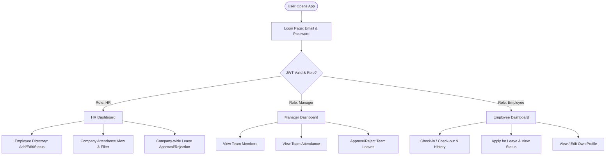

# Human Resource Management System (HRMS) - Planning & Architecture Document

> **Assessment**: AppTrait Solutions - Vibe Coder Practical Assessment  
> **Target Application**: Mini HRMS for SaaS Company  
> **Tech Stack**: MERN (MongoDB, Express.js, React.js, Node.js) + Tailwind CSS + JWT Authentication

---

## 1. Requirement Breakdown

The application is structured into 6 core functional modules derived from the 18 requirements in the task specification:

1. **Authentication & Security Module**:
   - JWT-based authentication with password hashing (bcrypt).
   - Middleware for Role-Based Access Control (RBAC) at backend endpoints.
   - Demo accounts auto-seeded for evaluation (HR, Manager, Employee).

2. **Employee Management Module**:
   - HR capabilities: Add employee, edit details, activate/deactivate account, assign managers, search & filter by department/status.
   - Profile management: Employee self-view and profile updates (e.g. phone number).

3. **Attendance Management Module**:
   - Daily Check-in & Check-out functionality for employees.
   - Daily attendance history log with status calculation (`Present`, `Absent`, `Half Day`, `Leave`).
   - Role-scoped views: Employee (own), Manager (team), HR (company-wide).

4. **Leave Management Module**:
   - Employee leave application (Leave type, start date, end date, total days calculation, reason).
   - Approval workflow: Manager approves/rejects team requests; HR approves/rejects all requests.
   - Rejection handling: Mandatory rejection reason text.

5. **Role-Based Dynamic Dashboards Module**:
   - **HR Dashboard**: Total Employees, Active Employees, Present Today, Employees on Leave, Pending Leave Requests.
   - **Manager Dashboard**: Total Team Members, Team Present Today, Team Members on Leave, Pending Team Approvals.
   - **Employee Dashboard**: Today's attendance status, Total leave requests, Pending requests, Approved/Rejected requests count, Recent attendance log.

6. **Edge Case & Validation Engine**:
   - Multi-layer validation for overlapping leaves, date ordering, check-in/out sequencing, leave-attendance conflicts, cross-team access blocks, and self-approval blocks.

---

## 2. Application Flow



### Detailed User Step-by-Step Flow:

1. **Authentication Flow**:
   - User inputs email and password on `/login`.
   - Backend authenticates against hashed password and returns a JWT token containing `{ id, role, email, managerId }`.
   - Frontend stores token securely and routes user to their respective dashboard based on role (`/dashboard/hr`, `/dashboard/manager`, or `/dashboard/employee`).

2. **HR / Admin Workflow**:
   - Log in -> Navigates to HR Dashboard (sees organization key metrics).
   - Click "Employee Management" -> Views table of all employees -> Filter by department/status or search by name -> Add new employee (assigning role & manager dropdown).
   - Click "Attendance" -> Views daily attendance of all employees across departments.
   - Click "Leave Requests" -> Reviews pending company requests -> Approves or Rejects with mandatory reason.

3. **Manager Workflow**:
   - Log in -> Navigates to Manager Dashboard (sees team metrics).
   - Click "My Team" -> Views team members reporting directly to this manager.
   - Click "Team Attendance" -> Views present/absent status of team members for today or selected date.
   - Click "Team Leaves" -> Reviews pending leave requests from team members -> Approves or Rejects (blocked from approving requests outside their team).

4. **Employee Workflow**:
   - Log in -> Navigates to Employee Dashboard (sees today's check-in status and leave stats).
   - Click "Mark Attendance" -> Clicks `Check-In` button (system logs timestamp and updates status to Present). Clicks `Check-Out` before leaving.
   - Click "Apply Leave" -> Fills form (Leave type, start date, end date, reason) -> Form validates dates -> Submits request.
   - Track Leave status -> Sees table of historical leave requests (`Pending`, `Approved`, `Rejected` + reason).

---

## 3. User Roles & Permission Matrix

| Feature / Action | HR / Admin | Manager | Employee |
| :--- | :---: | :---: | :---: |
| **View All Employees** | Yes | No | No |
| **Add / Create Employee** | Yes | No | No |
| **Edit Employee Info** | Yes | No | Own Profile Only |
| **Activate / Deactivate Employee** | Yes | No | No |
| **View Team Employees** | Yes | Yes | No |
| **Mark Attendance (Check-in/out)** | Optional | Optional | Yes |
| **View Attendance** | All | Team Members | Own Records Only |
| **Apply for Leave** | Yes | Yes | Yes |
| **Approve Leave** | All | Team Members | No |
| **Reject Leave (with reason)** | All | Team Members | No |
| **Dashboard View** | Company-wide | Team Overview | Self Overview |

---

## 4. Database Schema Design (MongoDB / Mongoose)

### Collection 1: `Users`
```javascript
{
  _id: ObjectId,
  employeeId: { type: String, required: true, unique: true }, // e.g. EMP-1001
  fullName: { type: String, required: true, trim: true },
  email: { type: String, required: true, unique: true, lowercase: true },
  password: { type: String, required: true }, // Hashed with bcrypt
  phone: { type: String, required: true },
  role: { type: String, enum: ['HR', 'Manager', 'Employee'], required: true },
  department: { type: String, enum: ['Engineering', 'HR', 'Sales', 'Marketing', 'Finance', 'Operations'], required: true },
  designation: { type: String, required: true },
  managerId: { type: Schema.Types.ObjectId, ref: 'User', default: null }, // Null for HR
  joiningDate: { type: Date, required: true },
  status: { type: String, enum: ['Active', 'Inactive'], default: 'Active' },
  createdAt: Date,
  updatedAt: Date
}
```

### Collection 2: `Attendance`
```javascript
{
  _id: ObjectId,
  employeeId: { type: Schema.Types.ObjectId, ref: 'User', required: true },
  date: { type: String, required: true }, // YYYY-MM-DD format for fast indexing
  checkInTime: { type: Date, required: true },
  checkOutTime: { type: Date, default: null },
  status: { type: String, enum: ['Present', 'Absent', 'Half Day', 'Leave'], default: 'Present' },
  remarks: { type: String, default: '' },
  createdAt: Date,
  updatedAt: Date
}
// Compound Unique Index: { employeeId: 1, date: 1 }
```

### Collection 3: `LeaveRequests`
```javascript
{
  _id: ObjectId,
  employeeId: { type: Schema.Types.ObjectId, ref: 'User', required: true },
  leaveType: { type: String, enum: ['Casual', 'Sick', 'Paid', 'Unpaid', 'Maternity/Paternity'], required: true },
  startDate: { type: Date, required: true },
  endDate: { type: Date, required: true },
  totalDays: { type: Number, required: true },
  reason: { type: String, required: true },
  status: { type: String, enum: ['Pending', 'Approved', 'Rejected'], default: 'Pending' },
  reviewedBy: { type: Schema.Types.ObjectId, ref: 'User', default: null },
  rejectionReason: { type: String, default: '' },
  reviewedAt: { type: Date, default: null },
  createdAt: Date,
  updatedAt: Date
}
```

---

## 5. Technology Selection & Justification

- **Frontend: React.js (Vite) + Tailwind CSS**
  - *Why*: Vite provides lightning-fast dev HMR. Tailwind CSS enables clean, modern, responsive UI design without bulky CSS frameworks.
- **Backend: Node.js + Express.js**
  - *Why*: Asynchronous I/O, middleware ecosystem, clean REST API controller separation, easy JWT auth handling.
- **Database: MongoDB + Mongoose**
  - *Why*: Flexible JSON-like document structure, seamless ODM integration with Node.js, built-in population (`.populate()`) for fetching user-manager relations.
- **Authentication: JSON Web Token (JWT) + Bcrypt**
  - *Why*: Stateless token verification; payload embeds `role` and `managerId` for instant backend middleware RBAC validation.
- **Deployment: Vercel (Frontend) + Render (Backend)**
  - *Why*: Reliable hosting platforms with instant automatic deployments from GitHub repo.

---

## 6. Complete API Specifications (22 APIs)

| # | Category | Method | Endpoint Route | Allowed Roles | Summary |
| :-: | :--- | :--- | :--- | :--- | :--- |
| **1** | Auth | `POST` | `/api/auth/login` | Public | Login & get JWT token |
| **2** | Auth | `GET` | `/api/auth/me` | All Roles | Get current authenticated user |
| **3** | Auth | `POST` | `/api/auth/logout` | All Roles | Logout session |
| **4** | Employee | `POST` | `/api/employees` | HR | Create new employee/manager |
| **5** | Employee | `GET` | `/api/employees` | HR, Manager | List employees (HR=All, Mgr=Team) |
| **6** | Employee | `GET` | `/api/employees/:id` | HR, Manager, Employee | Get employee profile (RBAC guarded) |
| **7** | Employee | `PUT` | `/api/employees/:id` | HR, Employee (self) | Update employee details |
| **8** | Employee | `PATCH` | `/api/employees/:id/status` | HR | Activate/Deactivate employee |
| **9** | Employee | `GET` | `/api/employees/managers/list` | HR | Dropdown list of managers/HR |
| **10** | Attendance | `POST` | `/api/attendance/check-in` | All Roles | Daily check-in |
| **11** | Attendance | `POST` | `/api/attendance/check-out` | All Roles | Daily check-out |
| **12** | Attendance | `GET` | `/api/attendance/today-status` | All Roles | Check today's check-in/out status |
| **13** | Attendance | `GET` | `/api/attendance/my-history` | All Roles | Personal attendance history |
| **14** | Attendance | `GET` | `/api/attendance/team` | Manager, HR | Team attendance history |
| **15** | Attendance | `GET` | `/api/attendance/all` | HR | Company-wide attendance log |
| **16** | Leave | `POST` | `/api/leaves` | All Roles | Apply for leave |
| **17** | Leave | `GET` | `/api/leaves/my-requests` | All Roles | Personal leave history |
| **18** | Leave | `GET` | `/api/leaves/team-requests` | Manager, HR | Team leave requests |
| **19** | Leave | `GET` | `/api/leaves/all-requests` | HR | All company leave requests |
| **20** | Leave | `PATCH` | `/api/leaves/:id/approve` | Manager, HR | Approve leave (No self approval) |
| **21** | Leave | `PATCH` | `/api/leaves/:id/reject` | Manager, HR | Reject leave with mandatory reason |
| **22** | Dashboard | `GET` | `/api/dashboard/stats` | All Roles | Dynamic role-based dashboard cards |

---

## 7. Business Logic & Edge Cases

1. **Overlapping Leaves**: Query existing leave requests for employee where `startDate <= newEndDate AND endDate >= newStartDate`. Reject if overlapping.
2. **Date Validation**: `endDate` must be `>= startDate`.
3. **Attendance vs Leave Conflict**: Block leave application if attendance (`Present`) exists on those dates; block check-in if user is on approved leave today.
4. **Attendance Order Enforcement**: Prevent check-in twice on same day; prevent check-out without check-in.
5. **Security & RBAC**:
   - **No Self Approval**: Manager cannot approve their own leave application (`req.user._id === leave.employeeId`).
   - **Cross-Team Access Block**: Manager cannot view/approve requests for employees outside their team (`leave.employeeId.managerId !== req.user._id`).
   - **URL/ID Tampering Protection**: Backend checks `req.user` role and ownership before returning single employee records or logs.

---

## 8. Proposed Project Folder Structure (MERN Stack)

```
HRMS_APPTRAIT/
├── client/                      # React Frontend (Vite + Tailwind CSS)
│   ├── public/
│   ├── src/
│   │   ├── assets/              # Icons, images
│   │   ├── components/          # Reusable UI (Navbar, Sidebar, Modal, Cards, Table, Badge)
│   │   ├── context/             # AuthContext (user state, login, logout, token)
│   │   ├── pages/               # Page Components
│   │   │   ├── Login.jsx
│   │   │   ├── HRDashboard.jsx
│   │   │   ├── ManagerDashboard.jsx
│   │   │   ├── EmployeeDashboard.jsx
│   │   │   ├── EmployeesList.jsx
│   │   │   ├── AttendancePage.jsx
│   │   │   ├── LeaveManagementPage.jsx
│   │   │   └── ProfilePage.jsx
│   │   ├── services/            # Axios API instances & service calls
│   │   ├── utils/               # Date helpers, formatters, role helpers
│   │   ├── App.jsx              # Main App & Router setup
│   │   ├── index.css            # Tailwind directives & core design system
│   │   └── main.jsx
│   ├── package.json
│   ├── tailwind.config.js
│   └── vite.config.js
│
├── server/                      # Node.js + Express Backend
│   ├── config/                  # DB Connection (db.js) & Environment config
│   ├── controllers/             # Request handlers
│   │   ├── authController.js
│   │   ├── employeeController.js
│   │   ├── attendanceController.js
│   │   ├── leaveController.js
│   │   └── dashboardController.js
│   ├── middleware/              # Security & RBAC middleware
│   │   ├── authMiddleware.js    # JWT verification
│   │   └── roleMiddleware.js    # HR, Manager, Employee access guard
│   ├── models/                  # Mongoose Schemas
│   │   ├── User.js
│   │   ├── Attendance.js
│   │   └── LeaveRequest.js
│   ├── routes/                  # Express Router definitions
│   │   ├── authRoutes.js
│   │   ├── employeeRoutes.js
│   │   ├── attendanceRoutes.js
│   │   ├── leaveRoutes.js
│   │   └── dashboardRoutes.js
│   ├── utils/                   # Seed data script & helper utilities
│   │   └── seeder.js            # Seed HR, Manager & Employee demo credentials
│   ├── index.js                 # Server entry point
│   └── package.json
│
├── AppTrait_Solutions_Vibe_Coder_HRMS_Practical_Assessment.pdf
├── planning.md                  # Comprehensive Planning & Architecture Doc
└── README.md                    # Project README with setup, demo creds & AI report
```

---

## 9. Submission Deliverables Checklist
- [x] **Planning Document (`planning.md`)**: Full requirements analysis, app flow, DB design, tech selection, API specs, edge cases.
- [ ] **MERN Codebase (`/client` and `/server`)**: Clean, well-structured, production-ready code with RBAC.
- [ ] **Database Seeder (`seeder.js`)**: Auto-populate demo credentials for HR, Manager, and Employee.
- [ ] **README.md**: Includes project overview, architecture, demo credentials, setup instructions, and the **AI Development Process** section (5 prompts + 2 code reviews).
